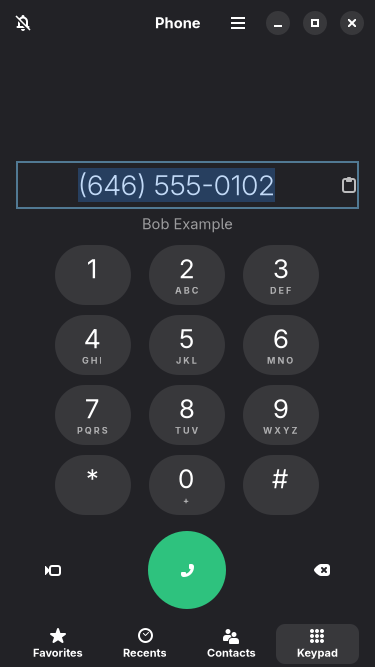
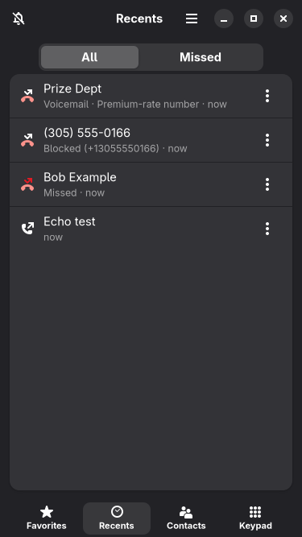
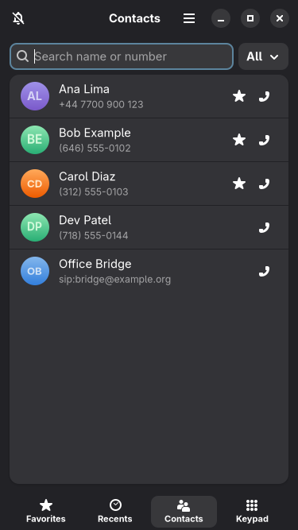
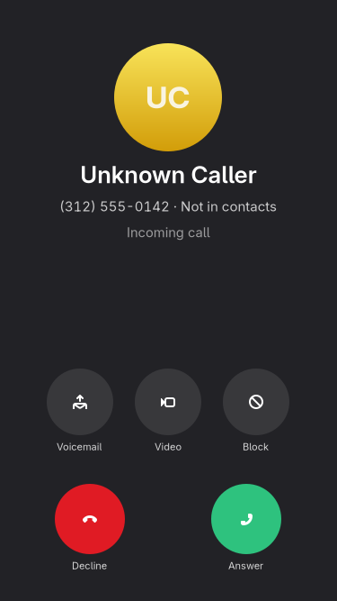
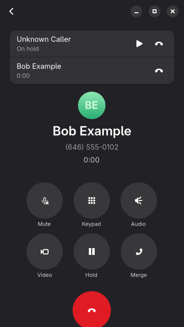
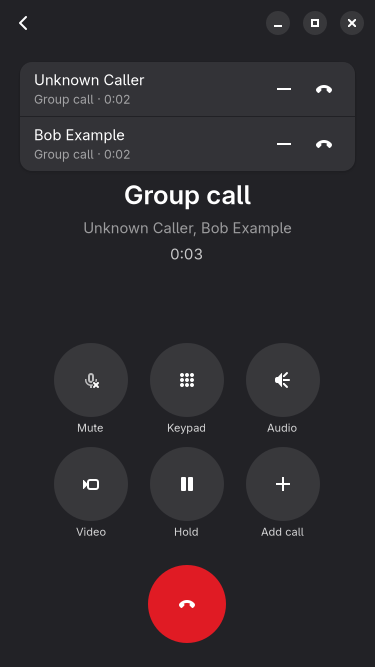

# Omarchy Phone: Phone app

Calls over Wi-Fi (no modem needed), contacts, call history and call screening, sized for a
375x667 touch screen. Design: [docs/phone/DESIGN.md](../../docs/phone/DESIGN.md), D-Bus API:
[docs/phone/API.md](../../docs/phone/API.md).

| Keypad | Recents | Contacts | Incoming | In call | Group call |
|---|---|---|---|---|---|
|  |  |  |  |  |  |

## Parts

- `phoned` (`omarchy_phone/daemon.py`): session daemon; owns calls, contacts (SQLite), screening,
  audio routing and notifications. Backends: `loopback` (local test calls, signalling only) and `sip`
  (baresip via `ctrl_tcp`; `phoned --backend sip --baresip 127.0.0.1:4444`). baresip must load the
  `account`, `menu` and `ctrl_tcp` modules.
- `omarchy-phone` (`omarchy_phone/ui.py`): GTK4 + libadwaita UI; starts phoned if it is not running.
- `phonectl` (`omarchy_phone/cli.py`): CLI for scripts and the shell.

Requirements: Python 3.11+, PyGObject, GTK 4.10+, libadwaita 1.7+, PipeWire (`pw-dump`, `wpctl`).
Optional: `python-phonenumbers` (libphonenumber; a built-in fallback is used without it), `baresip`.

## Try it (no accounts, nothing leaves 127.0.0.1)

```sh
cd apps/phone
bin/omarchy-phone                       # starts phoned (profile "default") and the UI
bin/phonectl import tests/data/sample.vcf
```

Call yourself: start a second phone and dial it from the first.

```sh
bin/phoned --profile bob --number "+1 646 555 0102" --display Bob &
bin/omarchy-phone --profile bob &       # second window
bin/phonectl dial loop:bob              # or dial +1 646 555 0102 from the keypad
bin/phonectl --profile bob answer
bin/phonectl dial loop:echo             # a peer that answers by itself
bin/phonectl simulate "+1 900 555 0123" "Prize Dept"   # fake an incoming call (screened as premium-rate)
```

Real SIP calls against a throwaway local PBX (Asterisk + two baresip endpoints in Docker; ports
bound to 127.0.0.1, test accounts only, tone in and WAV out so no sound devices are used):

```sh
docker build -t omarchy-phone-sipbed tests/sipbed
docker run -d --rm --name sipbed -p 127.0.0.1:4444:4444 -p 127.0.0.1:4445:4445 omarchy-phone-sipbed
bin/phoned --profile alice --backend sip --baresip 127.0.0.1:4444 --number "+1 212 555 0101" &
bin/phoned --profile bob --backend sip --baresip 127.0.0.1:4445 --number "+1 646 555 0102" &
bin/phonectl --profile alice dial "+1 646 555 0102"   # also: sip:600@127.0.0.1 (echo service)
bin/phonectl --profile bob answer
docker rm -f sipbed
```

Phone-like rendering on a laptop: `GSK_RENDERER=cairo bin/omarchy-phone` (software rendering), and
float the window at 375x667 in Hyprland. Data lives in `$XDG_DATA_HOME/omarchy-phone/`; nothing is
written to `~/.config`. The loopback backend carries signalling only, no audio.

The daemon changes the system default sink only when you pick an audio route in a call (and restores
it at hangup); set `OMARCHY_PHONE_AUDIO_DRYRUN=1` to disable that.

## Tests

```sh
scripts/test.sh            # all 55 tests on a private D-Bus session (includes the shell contract)
python3 -m unittest discover -s tests -t .   # same, minus the 3 tests that need a private bus
scripts/screenshots.sh     # re-render docs/phone/screenshots headlessly (gtk4-broadwayd)
```

- `test_numbers.py`: normalization, formatting, detection in text, false positives
  (dates, times, IPs, prices, order IDs, card numbers, URLs, OTP codes).
- `test_screening.py`: rule precedence, DND + repeat callers + allowed groups, block/allow
  patterns, withheld, spam, neighbour spoofing, emergency numbers.
- `test_vcard.py`: vCard 2.1/3.0/4.0 import, quoted-printable, folding, round trip, store merge.
- `test_calls.py`: real loopback calls between instances: answer/hold/video/mute, missed,
  decline, voicemail, blocked before ringing, DND, group call merge + leave; baresip protocol.
- `test_notify.py`: incoming/pill/missed notifications against a fake shell notification server.
- `test_sip.py`: real SIP calls through Asterisk + two baresip endpoints in a Docker container
  (`tests/sipbed/`): ring, answer, decline, cancel, block, hold/resume, mute, DTMF, hangup, echo
  service, both `phoned` daemons over D-Bus, and audio checked in the recordings (a 440/880 Hz tone
  each way, silence while muted). Everything stays on 127.0.0.1; test accounts only. Skipped
  without Docker or with `OMARCHY_PHONE_SKIP_SIPBED=1`. The first run builds the image (compiles
  baresip, a few minutes); it is kept as `omarchy-phone-sipbed:<hash>` (`docker rmi` to drop it).
  The container is removed after the run.

## Install files (not installed automatically)

`data/org.omarchy.Phone.desktop` (also the `tel:`/`sip:` URI handler) and `data/phoned.service`
(systemd user unit).
