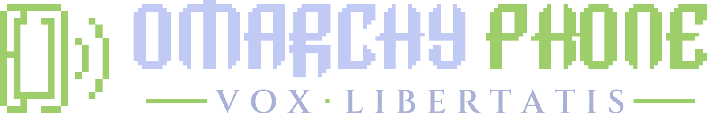

# Omarchy Phone brand



## Concept

**The mark** is the Omarchy icon turned into a phone. The Omarchy icon is a
15×15 pixel square with an outer ring and an inner ring, one tab at the top,
one on the left and one at the bottom, and a break in each ring. Here it stands
upright as a 10×16 handset, with the same one-cell strokes, the same one-cell
spacing and all three tabs:

- the break in the inner ring becomes the earpiece notch,
- the break in the outer ring becomes the charging port,
- the left tab becomes the side button,
- the outer corners are stepped one cell, like the corners of the Omarchy
  letters, so the square reads as a handset.

Two stepped sound arcs come out of its right side. That is the *vox*: the
ring opened up into a voice. The whole mark sits on a 16×16 grid, so each
launcher icon size puts every cell on whole pixels (48 px is 3 px a cell,
1024 px is 64 px a cell) and the icons stay sharp without hinting.

**The wordmark** is `OMARCHY` exactly as in Omarchy's `logo.svg`, cell for
cell, followed by `PHONE` drawn to the same rules: 15-unit cells, 3-cell stems,
9-cell bodies, 2 cells between letters, and the same slanted cuts at the ends
of the strokes. `H` and `O` are Omarchy's own letters. `P` is Omarchy's `R`
without its leg. `N` is Omarchy's `M` with one stem fewer (the font's `M` is an
arched lowercase form, so the `N` is one too). `E` is Omarchy's `C` with the
bowl bar from the `R`.

**The motto**, *Vox Libertatis* ("the voice of freedom"), is set in Roman
inscriptional capitals (Cinzel, after the Trajan inscription), widely tracked,
with a square interpunct between the words as on Roman monuments. The square
dot and the two rules are one wordmark cell thick, which ties the classical
line back to the pixel grid.

## Files

| File | What |
|---|---|
| `logo.svg` | Mark + wordmark + motto. Adapts to light or dark colour scheme (CSS `prefers-color-scheme`; renderers without media queries show the light version) |
| `logo-light.svg`, `logo-dark.svg` | The same with fixed colours: `-light` for light backgrounds, `-dark` for dark backgrounds |
| `mark.svg`, `mark-light.svg`, `mark-dark.svg` | The mark on its own, 16×16 grid |
| `wordmark.svg`, `wordmark-light.svg`, `wordmark-dark.svg` | `OMARCHY PHONE` on its own |
| `social-preview.svg` | 1280×640 stacked lockup on the Tokyo Night background |
| `png/icon-{48,64,128,256,512,1024}.png` | Launcher / app icons: the mark in Omarchy green on transparent, edge to edge, the same way Omarchy ships `icon.png` |
| `png/social-preview-1280x640.png` | GitHub social preview (Settings → General → Social preview) |
| `png/logo-{light,dark}-1600.png` | Raster lockups for places that do not take SVG |
| `tools/build.py` | Generates every SVG from the pixel bitmaps and the Cinzel outlines |
| `tools/render.sh` | Renders the PNGs with `rsvg-convert` |

All SVGs are plain paths written by `tools/build.py`: no embedded raster, no
`<text>`, no fonts needed to display them.

## Colours

Omarchy's icon green is `#9ECE6A`, the `green` of Tokyo Night, which is
Omarchy's default theme. The dark-background colours all come from Omarchy's
`tokyo-night` theme. For light backgrounds the green is too pale (1.8:1 on
white), so the light variant uses the matching colours from Tokyo Night Day.

| Role | On dark | On light |
|---|---|---|
| Mark, `PHONE`, rules, interpunct | `#9ECE6A` (tokyo-night `green`) | `#587539` (Tokyo Night Day green) |
| `OMARCHY` | `#C0CAF5` (tokyo-night `bright_foreground`) | `#1A1B26` (tokyo-night `background`) |
| Motto | `#A9B1D6` (tokyo-night `foreground`) | `#414868` (tokyo-night `muted`) |
| Background | `#1A1B26` (tokyo-night `background`) | `#FFFFFF` |

## Fonts

- **Wordmark**: no font. It is pixel artwork on the Omarchy logo grid.
- **Motto**: [Cinzel](https://github.com/NDISCOVER/Cinzel) by Natanael Gama,
  weight 600, licensed under the SIL Open Font License 1.1 (full text in
  [`fonts/OFL.txt`](fonts/OFL.txt)). The SVGs contain the glyphs converted to
  outlines, which the OFL allows. The font file itself is not in this repo.
  To rebuild, get `Cinzel[wght].ttf` from
  [google/fonts](https://github.com/google/fonts/tree/main/ofl/cinzel) and run:

  ```sh
  python3 -m venv /tmp/venv && /tmp/venv/bin/pip install fonttools
  CINZEL_TTF=/path/to/Cinzel[wght].ttf /tmp/venv/bin/python brand/tools/build.py
  brand/tools/render.sh
  ```

For running text next to the logo, use Cinzel for classical headings and
JetBrains Mono (OFL, Omarchy's default terminal font) for everything else.

## Usage

- Use `logo.svg` wherever SVG is accepted. Use `logo-light.svg` or
  `logo-dark.svg` where the background is known. In GitHub Markdown use a
  `<picture>` with both, as the repo README does.
- Use the mark alone for launcher icons, favicons, avatars and anywhere under
  about 400 px wide. The full lockup needs room: the motto becomes hard to read
  below about 600 px wide.
- Keep clear space of at least 2 mark cells (1/8 of the mark's height) on
  every side.
- Don't stretch, rotate, recolour outside the palette above, outline, add
  shadows or glows, or redraw the letters. Change the artwork in
  `tools/build.py` and regenerate.
- At small sizes, render the mark at multiples of 16 px so the cells stay on
  whole pixels.

## Attribution and licence

The mark and the `OMARCHY` letters are derived from the Omarchy logo and icon
(`/usr/share/omarchy/logo.svg`, `/usr/share/omarchy/icon.png`), part of
[Omarchy](https://github.com/basecamp/omarchy) by David Heinemeier Hansson and
contributors, released under the MIT License:

```
Copyright (c) David Heinemeier Hansson

Permission is hereby granted, free of charge, to any person obtaining
a copy of this software and associated documentation files (the
"Software"), to deal in the Software without restriction, including
without limitation the rights to use, copy, modify, merge, publish,
distribute, sublicense, and/or sell copies of the Software, and to
permit persons to whom the Software is furnished to do so, subject to
the following conditions:

The above copyright notice and this permission notice shall be
included in all copies or substantial portions of the Software.

THE SOFTWARE IS PROVIDED "AS IS", WITHOUT WARRANTY OF ANY KIND,
EXPRESS OR IMPLIED, INCLUDING BUT NOT LIMITED TO THE WARRANTIES OF
MERCHANTABILITY, FITNESS FOR A PARTICULAR PURPOSE AND
NONINFRINGEMENT. IN NO EVENT SHALL THE AUTHORS OR COPYRIGHT HOLDERS BE
LIABLE FOR ANY CLAIM, DAMAGES OR OTHER LIABILITY, WHETHER IN AN ACTION
OF CONTRACT, TORT OR OTHERWISE, ARISING FROM, OUT OF OR IN CONNECTION
WITH THE SOFTWARE OR THE USE OR OTHER DEALINGS IN THE SOFTWARE.
```

The same notice is in [`LICENSE-omarchy.txt`](LICENSE-omarchy.txt). Keep it
with any copy of these files.

The MIT License covers copyright only. It says nothing about trademarks. No
trademark or brand-usage policy was found in the Omarchy repository, its
manual or the installed package. Omarchy Phone is an independent community
project. It is not affiliated with or endorsed by Omarchy, David Heinemeier
Hansson or 37signals/Basecamp.

The motto outlines come from Cinzel, © 2020 The Cinzel Project Authors,
SIL Open Font License 1.1 ([`fonts/OFL.txt`](fonts/OFL.txt)).
