# Omarchy Phone Hyprland: shell design

*Omarchy Phone: Vox Libertatis.*

The phone shell turns an Omarchy install (Arch + Hyprland) into something you can
use with one thumb on a 4.7" screen. It is a Hyprland config plus one QuickShell
(QML) process, the same stack Omarchy uses on the desktop, cut down to fit a
2-core, 2 GB, software-rendered phone.

First device: iPhone 6s (750x1334 at scale 2, 375x667 logical). Nothing in the
shell hard-codes that size. Everything scales from the screen's logical width.

## Goals and constraints

| Constraint | Consequence |
|---|---|
| Software rendering only (no GPU) | `QT_QUICK_BACKEND=software`: no shaders, `MultiEffect`, `layer.effect`, blur or drop shadows. Hyprland blur, shadows and rounding are off, and only fade/slide animations run. |
| 2 cores, 2 GB RAM | One QuickShell process for every shell surface. Panels are `Loader`s that unload when closed, hidden surfaces use `visible: false` (not opacity 0), no polling timers faster than 1 s, and screenshots in the switcher are captured once, not live. |
| Touch first, no mouse or keyboard | Every control is at least 44 logical px. Gestures come from the shell's own edge strips, so no Hyprland plugin (hyprgrass) is needed. |
| Five hardware keys | Home, Power, Vol+, Vol-, Mute are all Hyprland binds that call the shell's IPC, so the shell owns the behaviour and the binds also work on the lock screen (`locked = true`). |
| Many phones, not one | `Theme.u` = logical width / 375. Every size is `n * Theme.u`. Device quirks (panel mode, scale, touch transform, key names) live in `shell/hypr/devices/<device>.lua`. |

## Architecture

```
Hyprland (shell/hypr/hyprland.lua + devices/<device>.lua)
  workspace 1 "home"   always empty; the home-screen layer shows through
  workspace 2 "apps"   scrolling layout, one full-width column per app
  binds: hardware keys -> ophone-ctl -> qs ipc -> shell
        |
QuickShell (shell/qs/shell.qml), one process
  StatusBar      Top layer, exclusive 24u: time, Wi-Fi, BT, battery
  HomeScreen     Background layer: clock, paged app grid, dock
  NavBar         Top layer, exclusive 20u: home pill, swipe gestures, keyboard key
  Shade          Overlay: quick settings + notification list (pull down from top)
  Switcher       Overlay: app cards (swipe up and hold / double-press Home)
  Keyboard       Top layer, exclusive: on-screen keyboard, types via wtype
  LockScreen     ext-session-lock: clock, notifications, swipe up, PIN pad (PAM)
  CallSurface    Overlay (and inside the lock): incoming call, accept/decline
  Osd            Overlay: volume / silent mode toast
  NotificationServer   owns org.freedesktop.Notifications
```

### Window model: one app per screen

Hyprland's `scrolling` layout with `column_width = 1.0` gives every app a
full-width column. A window rule sends every app window to workspace 2, and
floating dialogs are centered and capped at the screen size. So:

* **Home** is `focus workspace 1`, which is empty, so the Background-layer home
  screen shows through. Nothing is torn down and apps keep running.
* **Launch** runs the desktop entry. The window rule moves it to workspace 2 and
  Hyprland follows it there.
* **Previous/next app**: swipe left or right on the nav bar, which moves focus
  one column left or right (`hl.dsp.focus({direction = "l"/"r"})`). The scrolling
  layout slides the column into view.
* **Switcher** lists the foreign toplevels (wlr-foreign-toplevel via
  `ToplevelManager`, so it doesn't depend on the compositor). Tap to
  `activate()`, flick a card up to `close()`.

A tiled layout that shrinks apps to half a phone screen is never useful here, so
none is configured.

### Gestures

The shell draws them itself with Qt `DragHandler`s on thin edge strips, so
touches in the middle of the screen always go to the app:

| Gesture | Where | Action |
|---|---|---|
| Pull down | status bar (top 24u) | open the shade: quick settings on top, notifications below |
| Swipe up | nav bar (bottom 20u) | home |
| Swipe up and hold / swipe past 35% of the height | nav bar | app switcher |
| Swipe left/right | nav bar | previous/next app |
| Tap keyboard glyph | nav bar, right side | toggle the on-screen keyboard |
| Swipe up | lock screen | show the PIN pad |
| Swipe card up | switcher | close that app |
| Swipe notification sideways | shade | dismiss it |

### Hardware keys

| Key (evdev, xkb keysym) | Press | Long press / other |
|---|---|---|
| KEY_HOMEPAGE, `XF86HomePage` | home (closes the shade/switcher first) | double press: switcher |
| KEY_POWER, `XF86PowerOff` | screen on: lock and turn the screen off. Screen off: turn it on (still locked). | long press: power menu (lock, restart shell, reboot, power off) |
| KEY_VOLUMEUP / DOWN, `XF86AudioRaise/LowerVolume` | volume ±5% with OSD. During an incoming call, Vol- silences the ringer. | repeat while held |
| KEY_MUTE, `XF86AudioMute` | toggle silent mode (ringer and notification sounds), OSD | |

On the phone, logind must not act on the power key
(`shell/system/logind-ophone.conf`: `HandlePowerKey=ignore`), so Hyprland sees it.

### Status bar

Time on the left, then Wi-Fi, Bluetooth and battery (percent + glyph) on the
right. Data sources are all event driven:
`Quickshell.Services.UPower` (battery), `Quickshell.Networking` (NetworkManager),
`Quickshell.Bluetooth` (BlueZ), and `SystemClock` at minute precision.

### Shade: notifications and quick settings

Quick settings tiles: Wi-Fi, Bluetooth, Silent, Airplane, Flashlight, Rotation
lock, plus a brightness slider. Every system action goes through
`shell/bin/ophone-sys`, which can be swapped per device, and which only prints
(does nothing) when `OPHONE_DRY_RUN=1`, as in the preview.

Notifications come from the shell's own `NotificationServer`, a normal
freedesktop notification daemon. Tapping a notification invokes its default
action, swiping it dismisses it, and a "Clear" button clears them all. New
notifications show as a banner under the status bar for 4 s, unless the shade is
open or the screen is locked.

### Lock screen

`WlSessionLock` (ext-session-lock-v1), so the compositor guarantees nothing
leaks around it. It shows the clock, date, a count of notifications (no content,
for privacy) and a swipe-up hint. Swiping up reveals a numeric PIN pad that
authenticates the user through PAM (service `ophone-lock`, shipped in
`shell/system/pam/`, or `$OPHONE_PAM_SERVICE`). In the preview (dry run), PAM is
never called: any PIN of four or more digits unlocks. An incoming call is shown on top of the lock with accept/decline, so
answering never requires unlocking. The motto sits under the clock.

### On-screen keyboard

No OSK is in the base install, and qt6-virtualkeyboard can't type into other
apps' windows. The shell ships a small QML keyboard (letters, symbols, shift,
backspace, enter) on a Top layer with an exclusive zone, so the app above it
shrinks instead of being covered. Keys are typed through `wtype`
(virtual-keyboard-v1). v1 toggles it by hand, from the nav bar's keyboard glyph, the
shade tile, or `SUPER+K`. Showing it automatically needs input-method-v2 (see
next steps).

### Theme

`Theme` singleton: a built-in dark palette, overridden by
`~/.local/state/omarchy/current/theme/colors.toml` when present (Omarchy's theme
state), so `omarchy-theme-set` restyles the phone too. `u` is the layout unit and
`font(n)` gives type sizes.

### App integration

See [INTEGRATION.md](INTEGRATION.md). In short, apps use standard freedesktop
notifications (`notify-send`, libnotify, any D-Bus client). An incoming call is a
notification with `category=call.incoming` plus `accept`/`decline` actions, and
the shell turns it into a full-screen call surface.

## Files

```
shell/hypr/hyprland.lua        phone Hyprland config (Lua, Hyprland 0.56)
shell/hypr/devices/*.lua       per-device monitor/touch/key profile
shell/qs/shell.qml             QuickShell entry point
shell/qs/Commons/Theme.qml     palette + scale unit
shell/qs/Surfaces/*.qml        StatusBar, HomeScreen, NavBar, Shade, Switcher, ...
shell/qs/Services/*.qml        Phone (state + actions), Notifs (daemon), Config (shell.json)
shell/qs/Widgets/*.qml         StatusRow, NotificationCard, CallCard, PinPad, Tile, ...
shell/bin/ophone-ctl           hardware-key / script entry point -> qs ipc
shell/bin/ophone-sys           system actions (Wi-Fi, BT, brightness, ...), dry-run aware
shell/preview/run.sh           isolated nested preview + screenshot scenarios
shell/system/                  logind drop-in, PAM file (installed by the image, not the shell)
```

## Preview harness

`shell/preview/run.sh <scenario>` starts a nested Hyprland inside a private
`XDG_RUNTIME_DIR`, a private D-Bus session (`dbus-run-session`) and private
XDG config/cache dirs. Its own window output is disabled, and a 750x1334 scale-2
headless output is added instead, so nothing appears on the host desktop and the
host's notifications are untouched. It runs the shell with
`QT_QUICK_BACKEND=software`, drives a scenario through `qs ipc`, captures the
headless output with `grim`, and kills everything by PID.
`shell/preview/run.sh --hold` keeps it running. `source /tmp/oph-$UID/env`
attaches another terminal (hyprctl, grim, notify-send, and `qs ipc` all reach
the preview, never the host).

| Scenario | Screenshot |
|---|---|
| home | 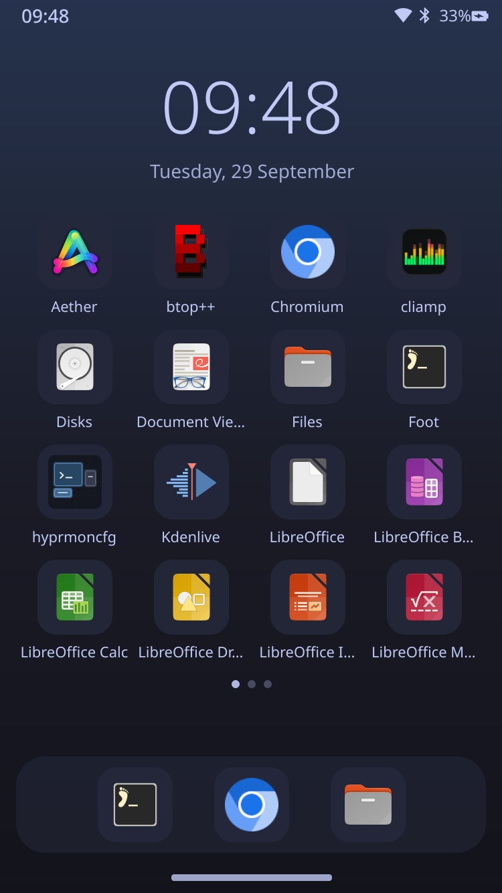 |
| notification | 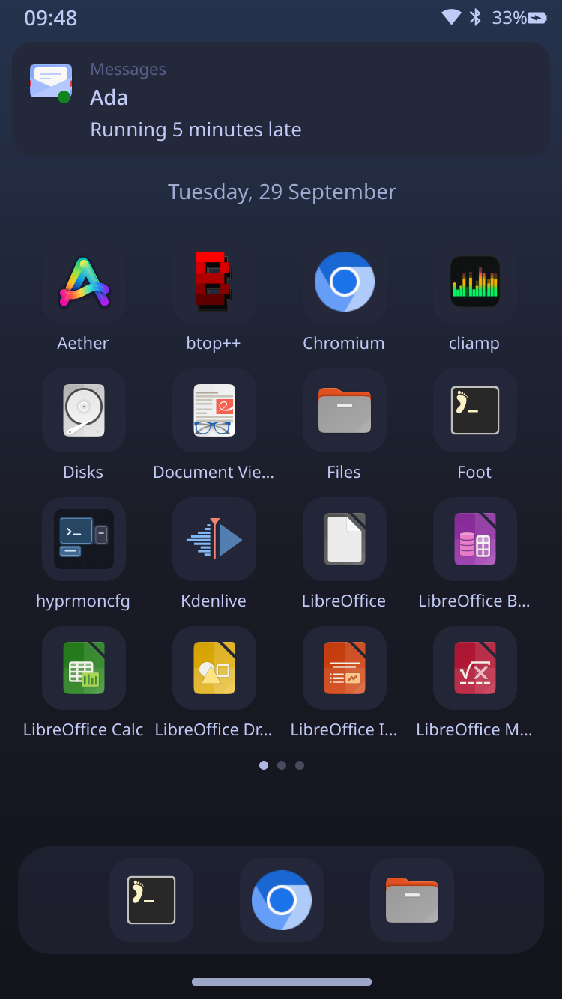 |
| shade | 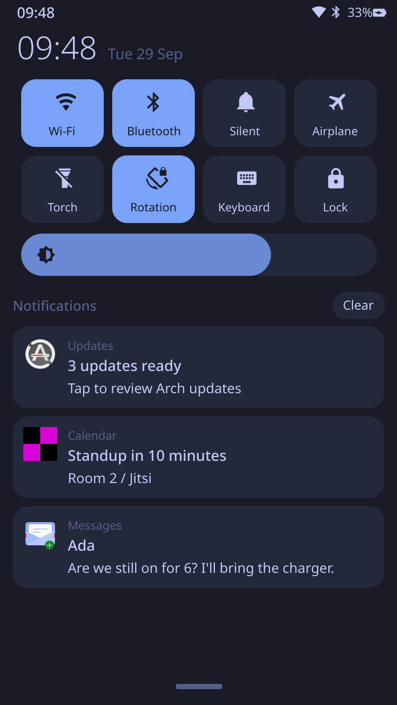 |
| app | 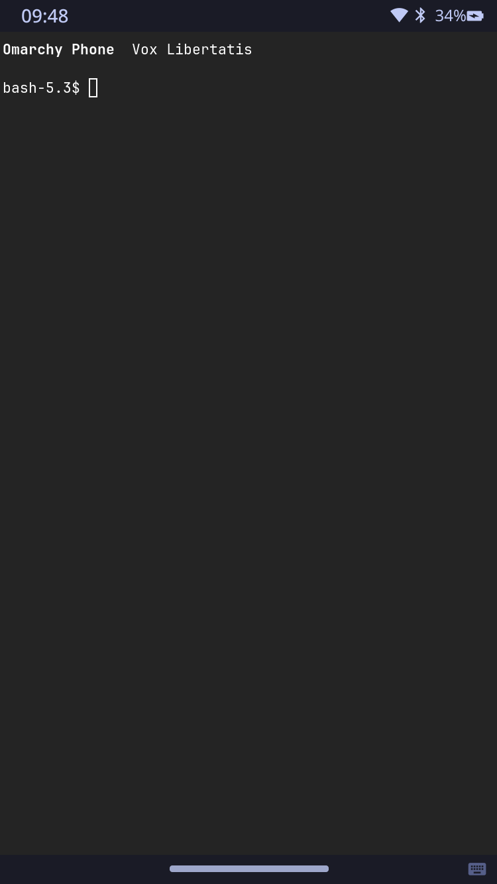 |
| keyboard | 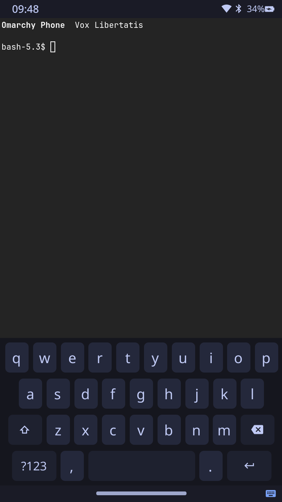 |
| switcher | 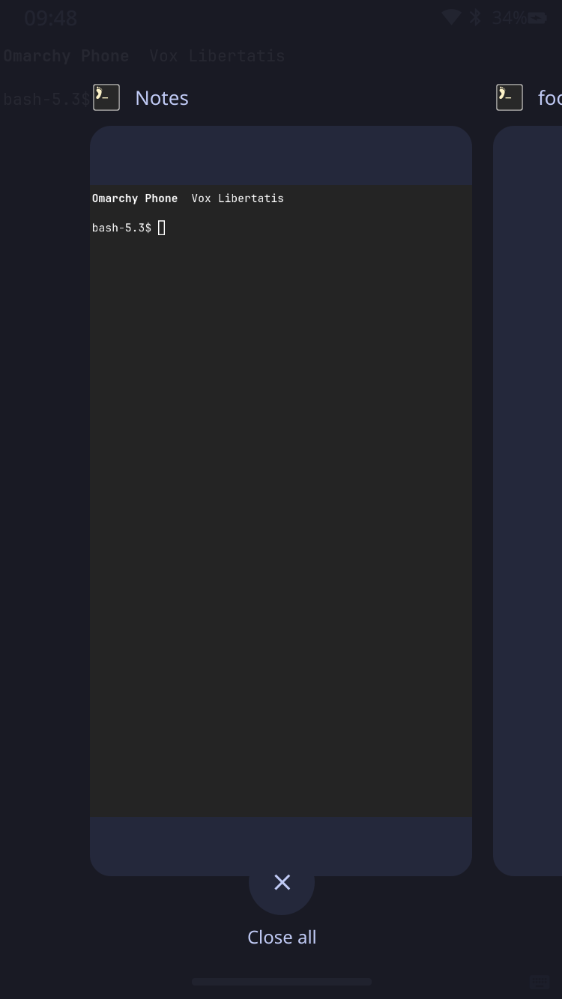 |
| lock | 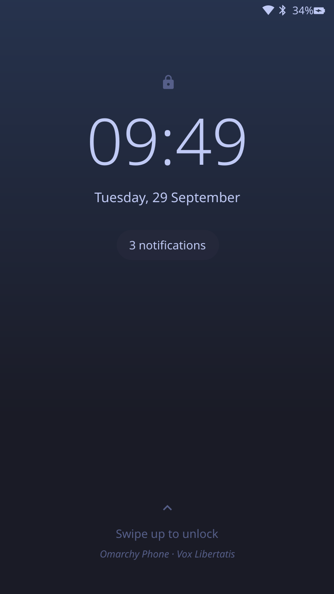 |
| pin | 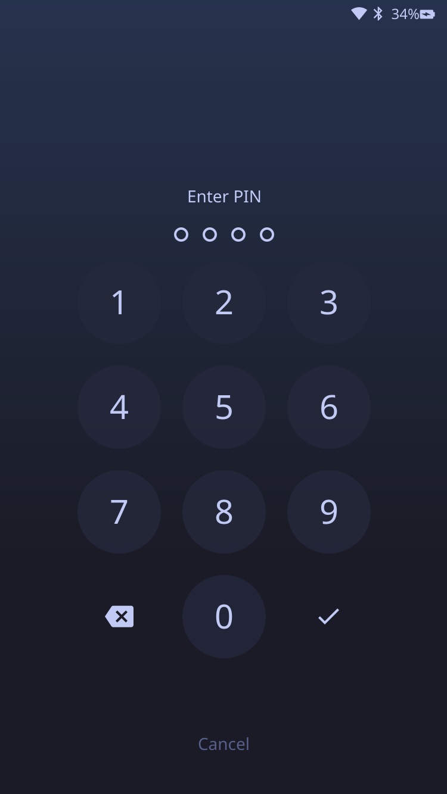 |
| call |  |
| osd | 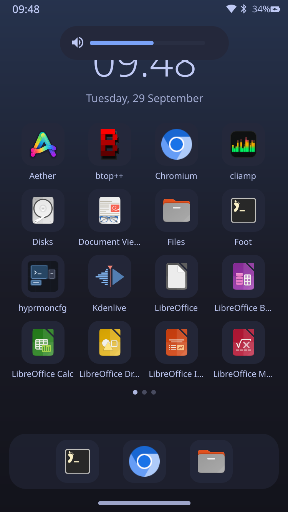 |
| power | 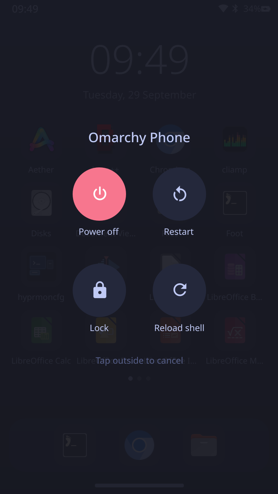 |
| lockcall | 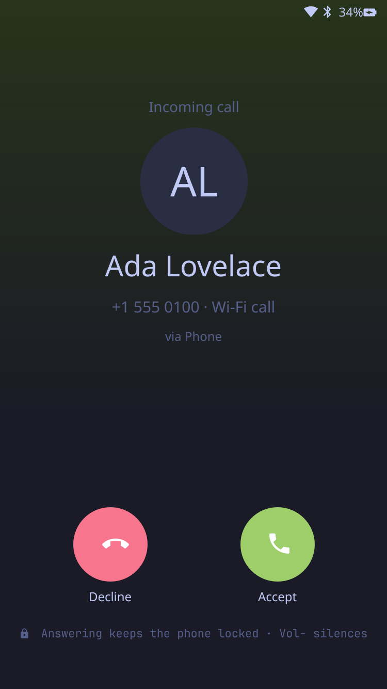 |

## Non-goals (v1) and next steps

* Keyboard auto-show: implement input-method-v2 (or ship wvkbd and toggle it
  from `text-input` focus events).
* Auto-rotation (iio-sensor-proxy to monitor `transform`, respecting the
  rotation-lock tile).
* Cellular modem (ModemManager), SMS, and a settings app.
* Inline replies in the shade (the daemon already advertises support).
* Fingerprint unlock (Touch ID isn't supported on this hardware under Linux).
* Measure memory and frame time on the real device, and trim anything costly.
