# Omarchy Phone Hyprland: shell design

*Omarchy Phone: Vox Libertatis.*

The phone shell turns an Omarchy install (Arch + Hyprland) into something you can
use with one thumb on a 4.7" screen. It is a Hyprland config plus one QuickShell
(QML) process, the same stack Omarchy uses on the desktop, cut down to fit a
2-core, 2 GB, software-rendered phone.

First device: iPhone 6s (750x1334 at scale 2, 375x667 logical). Nothing in the
shell hard-codes that size. Everything scales from the screen's logical width.

## Goals and constraints

| Constraint | Consequence |
|---|---|
| Software rendering only (no GPU) | `QT_QUICK_BACKEND=software`: no shaders, `MultiEffect`, `layer.effect`, blur or drop shadows. Hyprland blur, shadows and rounding are off, and only fade/slide animations run. |
| 2 cores, 2 GB RAM | One QuickShell process for every shell surface. Panels are `Loader`s that unload when closed, hidden surfaces use `visible: false` (not opacity 0), no polling timers faster than 1 s, and screenshots in the switcher are captured once, not live. |
| Touch first, keyboard complete | Every control is at least 44 logical px. Gestures come from the shell's own edge strips, so no Hyprland plugin (hyprgrass) is needed. Every surface can also be driven from a (Bluetooth) keyboard, because the first iPhone 6s boots have no working touchscreen (see [Keyboard](#keyboard)). |
| Five hardware keys | Home, Power, Vol+, Vol-, Mute are all Hyprland binds that call the shell's IPC, so the shell owns the behaviour and the binds also work on the lock screen (`locked = true`). |
| Many phones, not one | `Theme.u` = logical width / 375. Every size is `n * Theme.u`. Device quirks (panel mode, scale, touch transform, key names) live in `shell/hypr/devices/<device>.lua`. |

## Architecture

```
Hyprland (shell/hypr/hyprland.lua + devices/<device>.lua)
  workspace 1 "home"   always empty; the home-screen layer shows through
  workspace 2 "apps"   scrolling layout, one full-width column per app
  binds: hardware keys -> ophone-ctl -> qs ipc -> shell
        |
QuickShell (shell/qs/shell.qml), one process
  StatusBar      Top layer, exclusive 24u: time, Wi-Fi, BT, battery
  HomeScreen     Background layer: clock, paged app grid, dock
  NavBar         Top layer, exclusive 20u: home pill, swipe gestures, keyboard key
  Shade          Overlay: quick settings + notification list (pull down from top)
  Switcher       Overlay: app cards (swipe up and hold / double-press Home)
  Keyboard       Top layer, exclusive: on-screen keyboard, types via wtype
  LockScreen     ext-session-lock: clock, notifications, swipe up, PIN pad (PAM)
  CallSurface    Overlay (and inside the lock): incoming call, accept/decline
  Osd            Overlay: volume / silent mode toast
  NotificationServer   owns org.freedesktop.Notifications
```

### Window model: one app per screen

Hyprland's `scrolling` layout with `column_width = 1.0` gives every app a
full-width column. A window rule sends every app window to workspace 2, and
floating dialogs are centered and capped at the screen size. So:

* **Home** is `focus workspace 1`, which is empty, so the Background-layer home
  screen shows through. Nothing is torn down and apps keep running.
* **Launch** runs the desktop entry. The window rule moves it to workspace 2 and
  Hyprland follows it there.
* **Previous/next app**: swipe left or right on the nav bar, which moves focus
  one column left or right (`hl.dsp.focus({direction = "l"/"r"})`). The scrolling
  layout slides the column into view.
* **Switcher** lists the foreign toplevels (wlr-foreign-toplevel via
  `ToplevelManager`, so it doesn't depend on the compositor). Tap to
  `activate()`, flick a card up to `close()`.

A tiled layout that shrinks apps to half a phone screen is never useful here, so
none is configured.

### Gestures

The shell draws them itself with Qt `DragHandler`s on thin edge strips, so
touches in the middle of the screen always go to the app:

| Gesture | Where | Action |
|---|---|---|
| Pull down | status bar (top 24u) | open the shade: quick settings on top, notifications below |
| Swipe up | nav bar (bottom 20u) | home |
| Swipe up and hold / swipe past 35% of the height | nav bar | app switcher |
| Swipe left/right | nav bar | previous/next app |
| Tap keyboard glyph | nav bar, right side | toggle the on-screen keyboard |
| Swipe up | lock screen | show the PIN pad |
| Swipe card up | switcher | close that app |
| Swipe notification sideways | shade | dismiss it |

### Hardware keys

| Key (evdev, xkb keysym) | Press | Long press / other |
|---|---|---|
| KEY_HOMEPAGE, `XF86HomePage` | home (closes the shade/switcher first) | double press: switcher |
| KEY_POWER, `XF86PowerOff` | screen on: lock and turn the screen off. Screen off: turn it on (still locked). | long press: power menu (lock, restart shell, reboot, power off) |
| KEY_VOLUMEUP / DOWN, `XF86AudioRaise/LowerVolume` | volume ±5% with OSD. During an incoming call, Vol- silences the ringer. | repeat while held |
| KEY_MUTE, `XF86AudioMute` | toggle silent mode (ringer and notification sounds), OSD | |

On the phone, logind must not act on the power key
(`shell/system/logind-ophone.conf`: `HandlePowerKey=ignore`), so Hyprland sees it.

### Keyboard

The first iPhone 6s boots have no working touchscreen, so a Bluetooth keyboard
is the input, and every surface works without touch. Touch behaviour is
unchanged: the focus ring appears only once a key has moved it, and a tap
clears it.

Two layers handle keys:

* **Hyprland binds** (`shell/hypr/hyprland.lua`, SUPER + key) reach the shell
  from anywhere, including from inside an app. They dispatch the same
  `ophone:*` global shortcuts as the hardware keys, and the power, volume and
  mute binds also work on the lock screen (`locked = true`). A keyboard's own
  media keys (`XF86AudioRaiseVolume`, `XF86PowerOff`, ...) are the same
  keysyms as the phone's buttons, so they just work.
* **Plain keys** go to whichever shell surface is showing. Overlays (shade,
  switcher, power menu, incoming call) take exclusive keyboard focus while
  they are open. The home screen takes it only while the empty home
  workspace is showing and no overlay is open, so an app always keeps its
  keys. The lock screen gets them through ext-session-lock.

| Keys (anywhere) | Action |
|---|---|
| `SUPER+H` | home (closes the shade/switcher first) |
| `SUPER+Tab` | app switcher (again to close) |
| `SUPER+N` | pull-down shade (again to close) |
| `SUPER+L` | lock |
| `SUPER+Esc` | the power key: tap = lock and screen off, or wake the screen; hold = power menu. Works locked. |
| `SUPER+Shift+Esc` | power menu. Works locked. |
| `SUPER+Up` / `SUPER+Down` | volume ±5% with OSD, repeats while held; Down silences a ringing call. Works locked. |
| `SUPER+M` | silent mode. Works locked. |
| `SUPER+Left` / `SUPER+Right` | previous / next app |
| `SUPER+K` | on-screen keyboard |
| `SUPER+Return`, `SUPER+W` | terminal, close the focused app |

| Surface | Keys |
|---|---|
| Home | Arrows move the ring over the grid; Down from the bottom row enters the dock, Up leaves it. Tab / Shift+Tab walk grid then dock. Home/End jump to the first/last. PageDown/PageUp flip pages. Enter launches. Typing filters apps by name (prefix matches first) and shows a search chip in place of the date; Enter launches the ringed match, Backspace edits, Esc clears the search (then the ring). |
| Shade | Arrows/Tab move over the 8 tiles, the brightness bar and the notifications. Enter/Space toggles a tile or opens a notification. Left/Right on the bar sets brightness ±10%. Delete (or Backspace) dismisses a notification, Shift+Delete clears all. Esc closes. |
| Switcher | Left/Right (or Tab) selects a card, Home/End the first/last. Enter/Space switches to it. Delete closes that app, Shift+Delete closes all. Esc goes back. |
| Power menu | Arrows/Tab select, Enter/Space activates, Esc cancels. |
| Lock screen | Any key shows the PIN pad. Digits (top row or keypad) type the PIN and light the matching pad key, Backspace deletes, Enter unlocks, Esc hides the pad. |
| Incoming call (unlocked or over the lock) | Enter or A answers, Esc or D declines. Left/Right ring Decline/Accept, then Enter/Space presses the ringed one. |

When a surface is opened with its shortcut (`SUPER+Tab`, `SUPER+N`,
`SUPER+Shift+Esc`), it opens with the ring on its first item; opened by
touch, it shows no ring until a key is pressed. The ring is one accent
`Rectangle` outline (`Widgets/FocusRing.qml`) with no animation; page flips
reuse the page `ListView`'s own move (160 ms).

### Status bar

Time on the left, then Wi-Fi, Bluetooth and battery (percent + glyph) on the
right. Data sources are all event driven:
`Quickshell.Services.UPower` (battery), `Quickshell.Networking` (NetworkManager),
`Quickshell.Bluetooth` (BlueZ), and `SystemClock` at minute precision.

### Shade: notifications and quick settings

Quick settings tiles: Wi-Fi, Bluetooth, Silent, Airplane, Flashlight, Rotation
lock, plus a brightness slider. Every system action goes through
`shell/bin/ophone-sys`, which can be swapped per device, and which only prints
(does nothing) when `OPHONE_DRY_RUN=1`, as in the preview.

Notifications come from the shell's own `NotificationServer`, a normal
freedesktop notification daemon. Tapping a notification invokes its default
action, swiping it dismisses it, and a "Clear" button clears them all. New
notifications show as a banner under the status bar for 4 s, unless the shade is
open or the screen is locked.

### Lock screen

`WlSessionLock` (ext-session-lock-v1), so the compositor guarantees nothing
leaks around it. It shows the clock, date, a count of notifications (no content,
for privacy) and a swipe-up hint. Swiping up reveals a numeric PIN pad that
authenticates the user through PAM (service `ophone-lock`, shipped in
`shell/system/pam/`, or `$OPHONE_PAM_SERVICE`). In the preview (dry run), PAM is
never called: any PIN of four or more digits unlocks (unless `$OPHONE_PAM_DIR`
is set -- see [Lock screen PIN](#lock-screen-pin) below). An incoming call is
shown on top of the lock with accept/decline, so answering never requires
unlocking. The motto sits under the clock.

### Lock screen PIN

The security review (`~/Work/hoolock-iphone5s/notes/security-review.md`,
findings F2/F3) found that `shell/system/pam/ophone-lock` did `auth include
login` -- so the lock screen's "PIN" was actually the full account password,
checked over the same PAM chain as SSH and (via passwordless `wheel` sudo)
root. Two problems followed from that:

* `PinPad.qml` is digit-only. A non-numeric account password (the shipped
  default, `omarchy`, is non-numeric) can **never** match, so the lock
  screen was permanently unusable out of the box.
* Making it usable meant setting a numeric account password -- which then
  doubled as the SSH password and the sudo password. One short secret,
  guessable in the low thousands of tries even with throttling, would have
  gated the lock screen, remote shell access, and root all at once.

**Fix: the PIN is its own secret**, independent of `/etc/shadow` end to end:

* `shell/bin/ophone-pin` hashes the PIN with `scrypt` (N=2^14, r=8, p=1, a
  16-byte random salt, deliberately expensive -- see the module docstring)
  and writes it to `/etc/omarchy-phone/pin-hash` as
  `scrypt$N$r$p$<salt-hex>$<hash-hex>`. `sudo ophone-pin set` prompts for it
  twice (never on argv, so it's not visible via `ps` -- see F15 in the
  security review, the same lesson applied here). This is the provisioning
  command a future Omarchy settings/menu UI's "Change PIN" would shell out
  to; there is no UI for it yet (Config settings/menu app is a separate,
  not-yet-built project).
* `shell/system/pam/ophone-lock` no longer includes `login`. Its `auth`
  chain checks the PIN with `pam_exec.so expose_authtok` calling
  `ophone-pin verify` (the PIN arrives on the child's stdin, again never on
  argv), stacked with `pam_faillock` exactly the way `system-auth` stacks it
  around `pam_unix` -- see [Throttling](#throttling-pam_faillock) below.
  `account` is `pam_permit.so`: there's no shadow record for a PIN, so there
  is nothing account-side to check.

**Threat model / why this is a real improvement, not just indirection:**
whoever can *read* `pin-hash` is already running code as the phone's session
user -- which, given this device's passwordless `wheel` sudo (a separate,
still-open issue: F1 in the security review), already means root. So this
file being group-readable by that user (`root:omarchy`, mode `0640` -- see
below) gives away nothing an attacker with that level of access didn't
already have. What the separation actually buys: **the PIN can never be used
to SSH in or sudo, and the account/SSH password can never be brute-forced
through the lock screen's PIN pad or vice versa.** A wrong guess against one
never touches the other's throttling state, and a compromise of one secret
(e.g. the account password, over the network once Wi-Fi lands) doesn't hand
over the other.

**Why `0640` instead of the `0600` a "root-owned file" first suggests:** PAM
authentication here runs with the *caller's* privileges -- the shell,
running as the phone's session user, not root (`pam_exec` has no setuid
helper the way `pam_unix` has `unix_chkpwd`, and shipping a bespoke
setuid-root binary just to read one file is a bigger attack surface than the
group-readable file, and a much heavier review burden, for no real gain
given the paragraph above). So the file is `root:omarchy 0640`: unreadable to
any *other* local user, readable to the one process that legitimately needs
to check it. The stricter alternative -- a small setuid-root verifier binary
instead of a group-readable file -- is a reasonable next step if this ever
stops being a single-user device, but isn't needed today; see Non-goals.

This assumes the session user's primary group is per-user, not a shared
group like `users` -- true for this image's `useradd -U ...` (verified:
`tools/userland/build-rootfs.sh` in `omarchy-iphone6s`), which is exactly
what makes `_default_group()` in `ophone-pin` correct by default. If an
image ever changes that, set `$OPHONE_PIN_GROUP` explicitly rather than
relying on the invoking user's primary group.

**PIN configured at boot, or not:** `Phone.qml`'s `pinConfigured` reflects
whether `/etc/omarchy-phone/pin-hash` exists (a `FileView`, not a one-time
check, so running `ophone-pin set` while the shell is up takes effect
immediately). The shell only starts `locked: true` when a PIN is configured
(see [Idle auto-lock](#idle-auto-lock) for why this matters -- F4 below).

#### Throttling: pam_faillock

F3 in the security review confirmed `pam_faillock` was present (via the
`login` chain) and working. Dropping `include login` must not drop that.
`ophone-lock`'s `auth` chain stacks `pam_faillock.so preauth` /
`authfail` / `authsucc` around the `pam_exec` line, the same shape
`/etc/pam.d/system-auth` uses around `pam_unix`. The one wrinkle: the
default tally directory, `/run/faillock`, is `root:root 0755` -- writable
only by root, but this whole chain now runs as the unprivileged session
user, so `pam_faillock` would silently no-op (fail *open*, not closed) if
told to use it. It's pointed instead at `/run/omarchy-phone/faillock`
(`root:<user> 0770`, created by `shell/system/tmpfiles.d/omarchy-phone.conf`
-- see `shell/system/README.md`), a separate tally from the login/SSH one,
with explicit `deny=5 unlock_time=300` on every line (so the image can't
silently change the effective throttling by editing `/etc/security/faillock.conf`
without also touching this file). `sudo faillock --user <user> --dir
/run/omarchy-phone/faillock --reset` clears a lockout.

**Next step, not done here:** hooking `ophone-pin set` up to an actual
Omarchy settings/menu UI item ("Change PIN"); today it's a command line
tool, run once during device provisioning.

#### PAM wiring: LockAuth, not a PamContext inside WlSessionLock

The lock screen's PAM call is `qs/Services/LockAuth.qml`, a singleton, not a
`PamContext` declared inline in `LockScreen.qml`. This is a real bug found
while hardening this feature, not a style choice: `WlSessionLock`'s default
property is a single `Component` (its per-output `surface`), so *any* plain
object declared as its direct child other than the one
`WlSessionLockSurface` -- a `PamContext`, a `Connections`, anything -- gets
swept into that Component too. The practical effect: the object still
exists and its own internal bindings work, but a function defined directly
on `WlSessionLock` (like the old `tryUnlock`) cannot see an id declared
inside that swept-in Component (`pam is not defined`, a `ReferenceError`,
at runtime only -- silent until exercised), and a `Connections` swept in the
same way never fires at all, with no error whatsoever. Both were previously
unreachable: the preview's `dryRun` shortcut always returned before calling
into PAM, so nothing had ever run this code path in this preview until
`$OPHONE_PAM_DIR` was added for this task's verification. `LockScreen.qml`'s
root is now a plain `Item` wrapping `WlSessionLock` (whose only child is the
`WlSessionLockSurface`) and a sibling `Connections` targeting `LockAuth`; a
singleton also fixes a second latent bug the same mechanism caused: a
`PamContext` swept into a per-output `Component` would have been
re-instantiated once per output, running a separate, independent
authentication attempt per screen on any future multi-monitor device.

**Verified end to end** (see the top-level report for the exact commands):
using `$OPHONE_PAM_DIR` pointed at a scratch directory with a real
`ophone-lock` service file (absolute paths, `pam_exec.so expose_authtok
... ophone-pin verify <path>`, `pam_faillock.so ... dir=<path>`), a PIN set
with `ophone-pin set`, and the preview started with `$OPHONE_PIN_FILE`
pointing at that same hash file:

* correct PIN -> `ophone-ctl isLocked` -> `false`;
* wrong PIN -> stays `true`;
* 5 wrong PINs (`faillock --user <user> --dir <path>` shows exactly 5 tally
  entries -- `pam_faillock` correctly tallies as the unprivileged session
  user once given a directory it can write to), then the *correct* PIN ->
  still `true`, and the tally count is **unchanged** at 5 (the `requisite
  preauth` line denies before the `pam_exec`/`authfail` lines ever run, so a
  denied-by-lockout attempt adds no new entry) -- `deny=5` is really
  blocking a correct PIN, not just coincidentally failing;
* `faillock --user <user> --dir <path> --reset`, then the correct PIN again
  -> `false`.

This is the whole point of the F2/F3 fix demonstrated live: a PIN
independent of the account password, actually throttled.

### Idle auto-lock

F4 in the security review: `Phone.qml` used to default `locked: false`
unconditionally, with no idle timer anywhere in the shell -- a freshly
booted (or rebooted) phone came up fully unlocked until someone pressed
power once, and stayed unlocked forever after that if nobody did.

The fix has two parts, both in `Phone.qml`:

* **Boot lock.** `locked` starts `true` whenever a PIN is configured (see
  [Lock screen PIN](#lock-screen-pin)), and stays `false` only when there is
  genuinely no PIN to unlock with -- so this can never brick a freshly
  flashed, not-yet-provisioned device. The preview (`dryRun`) always boots
  unlocked, so none of the existing scenarios changed.
* **Idle timer.** An `IdleMonitor` (`Quickshell.Wayland`, wrapping
  `ext-idle-notify-v1`) locks the screen (if a PIN is configured) and blanks
  it (always, even without a PIN -- it's still worth the power saving) after
  `Config.idleLockSeconds` (default 180s) of no input, or
  `$OPHONE_IDLE_SECONDS` if set. This is the same protocol `hypridle`/
  `swayidle` use; Quickshell exposes it directly, so there's no separate
  `hypridle` process or config file to keep in sync with the shell's own
  idea of "locked" -- one fewer moving part, and consistent with this
  codebase already leaning on `Quickshell.Wayland` for `WlSessionLock`
  rather than a separate lock binary. `respectInhibitors: true` is set for
  when something (e.g. a future video-call app) creates a
  `zwp_idle_inhibitor_v1`; nothing does yet.

Waking the screen is deliberately still power-key-only
(`key_press_enables_dpms = false` / `mouse_move_enables_dpms = false` in
`hyprland.lua`, unchanged) -- an idle timeout that also woke on any input
would defeat the point of locking after inactivity.

**A units bug was caught here during verification, not shipped:**
`IdleMonitor.timeout` is **seconds** (confirmed with a from-scratch
standalone QML file: `timeout: 3` logs `Created ... IdleNotification(...)
with timeout: 3000` -- Quickshell's own debug line, `3000` being its
internal milliseconds -- and "has been marked idle" fires within the next
few seconds). The first version of this code multiplied by 1000 (treating
the property as if it took milliseconds), which would have shipped a
default idle timeout of 180,000 seconds (50 hours) -- an idle-lock that,
for all practical purposes, never locks. Fixed by removing the multiply;
`Phone.qml`'s `timeout` binding now passes `Config.idleLockSeconds` /
`$OPHONE_IDLE_SECONDS` straight through.

**Verified end to end** after the fix: with a PIN configured
(`$OPHONE_PIN_FILE` pointing at a real hash) and `$OPHONE_IDLE_SECONDS=4`,
starting the preview and waiting, completely hands-off (no `qs ipc`/`hyprctl`
calls at all -- those count as activity to Hyprland's idle tracking and
would rearm the timer), `ophone-ctl isLocked` read `true` after the wait.

### Bluetooth pairing confirmation

F5/F6 in the security review: with no application agent registered
anywhere in the image, `bluetoothd` falls back to its own built-in agent,
which has I/O capability `NoInputNoOutput` -- it auto-accepts "Just Works"
pairing (and the closely related no-passkey `RequestAuthorization` path)
from anything in range, with no on-screen confirmation at all. Combined with
this device's passwordless `wheel` sudo, a trusted Bluetooth keyboard is
keystroke injection into a root shell; the `driver/bluetooth-adv-fix`
bring-up log in `omarchy-iphone6s` demonstrates exactly that pairing
succeeding today.

`shell/bin/ophone-btagentd` is a small Python daemon (GLib/`python-gobject`,
already a dependency of the Phone app) that:

1. Registers a **`KeyboardDisplay`** `org.bluez.Agent1` at
   `/org/omarchy/phone/agent` on the system bus and calls
   `RequestDefaultAgent`, replacing the fallback agent.
2. On `RequestConfirmation`, `RequestAuthorization`, or `AuthorizeService` --
   the three calls that would otherwise auto-accept -- sends a normal
   freedesktop notification (`urgency: critical`, actions `pair`/`reject`,
   `resident: true`) through the session bus and **holds the D-Bus call
   open** until the user taps a button or `$OPHONE_BT_TIMEOUT` (default 30s)
   elapses. A timeout, a `reject` tap, or the notification being dismissed
   without a tap all deny (`org.bluez.Error.Rejected`) -- deny by default,
   the same posture as the lock screen requiring an explicit swipe before
   the PIN pad even shows. See `docs/shell/INTEGRATION.md` "Bluetooth
   pairing confirmation": this is a plain notification, nothing
   shell-specific, so it follows the same locked-phone privacy rule as
   everything else -- while locked, it shows only as a count, so a request
   made against a locked phone simply times out unanswered.
3. `DisplayPasskey`/`DisplayPinCode` (bluetoothd asking *this* phone to show
   a code) need no accept/reject -- their security comes from the peer
   having to type back a code it can only know by reading this phone's
   screen, which is itself the mitigation for the BLE-keyboard scenario
   above (pairing a keyboard-only peripheral against a `KeyboardDisplay`
   agent negotiates Passkey Entry, not Just Works).
4. `RequestPasskey`/`RequestPinCode` (this phone being asked to *provide* a
   code) are refused rather than silently accepted or fabricated -- there's
   no on-screen numeric entry UI yet; see Non-goals.

`shell/system/bluetooth/main.conf` complements the agent: not
discoverable/pairable at rest (`Discoverable = false`, `Pairable = false`,
`PairableTimeout = 180`), `JustWorksRepairing = never`, and `Privacy =
device` for a resolvable LE address instead of the fixed hardware one. This
shrinks the window an attacker has to try in the first place; the agent is
what actually closes F5/F6, since the built-in fallback agent would honor
these same settings and still auto-accept whatever pairing it is allowed to
see.

`shell/system/systemd/ophone-btagentd.service` (a user unit, `systemctl
--user enable --now`) starts it with the graphical session -- see
`shell/system/README.md`. **What the image side needs to add:** the
`ophone-btagentd.service` unit installed and enabled, and
`bluetooth/main.conf` installed to `/etc/bluetooth/main.conf`; no new
packages (`python-gobject`/`python` and `bluez`/`bluez-utils` are already in
`packages.txt`).

### On-screen keyboard

No OSK is in the base install, and qt6-virtualkeyboard can't type into other
apps' windows. The shell ships a small QML keyboard (letters, symbols, shift,
backspace, enter) on a Top layer with an exclusive zone, so the app above it
shrinks instead of being covered, never the reverse: input-method-v2 only
hands the input method surrounding text and a purpose hint, not a rectangle
for every app, so there's no reliable coordinate to slide the keyboard around
without risking it landing on top of the field instead of below it. Resizing
the toplevel is the one thing that's guaranteed to keep the focused field
visible (GTK scrolls the focused entry into view when its window shrinks;
foot just reflows).

**Showing and hiding it.** `shell/im/ophone-im.c` is a small standalone
process (no UI, ~150 lines) that binds `zwp_input_method_manager_v2` and
becomes *an* input method for the seat — not a competing OSK, just a listener
for `activate`/`deactivate`. Quickshell (`Services/Phone.qml`) spawns it as a
child process and reads one line per state change from its stdout:

| Line | Meaning |
|---|---|
| `active` | a `text-input-v3` field is now focused |
| `inactive` | none is |
| `unavailable` | another input method is already bound to this seat (e.g. fcitx5); auto show/hide is disabled and only the manual toggle works |

`zwp_input_method_v2` is a real Wayland protocol object, not a heuristic:
GTK4, Chromium/Electron and most Qt apps create a `text-input-v3` object and
call `enable()`/`disable()` on it as focus moves, and **foot also speaks it**
(for IME composition), so a terminal auto-shows the keyboard too, not just
GUI apps. Typing goes through the same connection when a field is focused —
`commit_string` for plain characters and `delete_surrounding_text` for
backspace, which is the correct path for an input method and doesn't depend
on wtype racing key events into whatever the compositor currently thinks has
focus. Enter has no input-method equivalent (apps read a real `Return`
keysym to submit/newline) and anything with no focused field (an app that
never adopted text-input-v3) has no input method to talk to either, so both
still fall back to `wtype` (virtual-keyboard-v1), as before.

`Phone.keyboardOpen` is derived, never set directly:
`keyboardPinned || (imFieldFocused && !keyboardSuppressed && !hardwareKeyboardConnected)`.
The manual toggle (`SUPER+K`, the nav-bar glyph, the shade tile) flips
`keyboardPinned`/`keyboardSuppressed` and always works, including with no
field focused (a plain terminal command line) or with a Bluetooth keyboard
connected (`hardwareKeyboardConnected`: a connected `Quickshell.Bluetooth`
device with `icon === "input-keyboard"`), which only suppresses the
*automatic* show. Losing focus always closes it and clears the manual
override, so the next distinct field starts from a clean auto-show/hide
cycle. `home()` and `lock()` reset all of it, so leaving an app or locking
the screen never leaves a stale keyboard.

**Why a helper process instead of squeekboard or wvkbd.** Quickshell 0.3.1
has no `Quickshell.TextInput`/input-method QML module (checked against
`/usr/lib/qt6/qml/Quickshell/`), so something outside QML has to speak the
protocol. squeekboard is the GNOME OSK and *is* an input method, but it draws
its own GTK keyboard UI (can't reuse just its focus-watching half) and pulls
in gtk3 + gnome-desktop + feedbackd — heavy for a 2 GB phone and it would
fight the shell's own themed keyboard. wvkbd doesn't watch input-method-v2 at
all (X11-style: always visible, manually toggled) and isn't in Arch Linux ARM's
repos (AUR only). ophone-im links only `libwayland-client`, which quickshell
already depends on, so it adds no new runtime package and costs about 1 MB
RSS. Next step: use the `content_type` event (purpose/hint, already received
and currently ignored) to switch to a numeric layout for phone-number/digit
fields, and to skip showing a preview of typed characters for password
fields.

### Theme

`Theme` singleton: a built-in dark palette, overridden by
`$XDG_STATE_HOME/omarchy/current/theme/colors.toml` (falling back to
`$HOME/.local/state`, same default `omarchy-theme-set` uses) when present, so
`omarchy-theme-set` restyles the phone too -- **live**, without restarting
the shell. `u` is the layout unit and `font(n)` gives type sizes.

Getting the live part right took a second FileView. `omarchy-theme-set`
swaps a theme with `rm -rf current/theme; mv next-theme current/theme` (see
`/usr/share/omarchy/bin/omarchy-theme-set`): the `theme/` directory's inode
is destroyed and a new one put in its place. A `FileView` watching
`current/theme/colors.toml` (or the `theme/` directory itself) holds an
inotify watch on that now-dead inode -- the watch fires once (`IN_IGNORED`)
and then never again, so the very first theme swap after the shell starts
silently stops live reload from working, permanently, until the shell is
restarted. That's the bug this task fixes.

The fix watches something that survives the swap instead:
`current/theme.name`, a plain marker file `omarchy-theme-set` writes with a
`>` redirect (`echo "$THEME_NAME" >current/theme.name`) -- an in-place
truncate-and-write, not a replace, so its inode (and inotify watch) survives
every swap. `Theme.qml` now has two `FileView`s: one on `theme.name`, with
`watchChanges: true`, whose `onFileChanged` calls `reload()` on *itself* and
on the second `FileView` (on `colors.toml`, not directly watched at all).
That second read is a plain re-open by path, so it always picks up whatever
`colors.toml` exists right now regardless of the directory swap underneath
it -- the broken-watch problem only had to be solved once, for the file
that doesn't have it.

Building the path from `$XDG_STATE_HOME` rather than always `$HOME` is a
side benefit for testability, not just correctness: `shell/preview/run.sh`
already runs with a private `XDG_STATE_HOME`, so the preview can simulate a
theme swap in its own scratch directory instead of (accidentally) reading
the real desktop session's live theme.

**Verified** (see the top-level report for the exact commands):
`shell/preview/run.sh` gained a test-only `OPHONE_SEED_THEME_DIR`/
`OPHONE_SEED_THEME_NAME` pair that seeds a theme into the private
`XDG_STATE_HOME` before Hyprland/qs start, so a theme can be present *at
boot* -- the actual bug scenario, not the "appears for the first time"
case. Seeded a first theme (`background = "#111111"`), started the preview,
confirmed it applied at startup; then, against the running shell, performed
the exact `rm -rf current/theme; mv next-theme current/theme; echo
theme-two >current/theme.name` sequence `omarchy-theme-set` does, with a
second theme (`background = "#004400"`); then a third
(`background = "#220044"`). Confirmed each swap applied live, without
restarting `qs`, by (temporarily, for this verification) logging
`root.background` from the `colorsFile` `onLoaded` handler.

### App integration

See [INTEGRATION.md](INTEGRATION.md). In short, apps use standard freedesktop
notifications (`notify-send`, libnotify, any D-Bus client). An incoming call is a
notification with `category=call.incoming` plus `accept`/`decline` actions, and
the shell turns it into a full-screen call surface.

## Files

```
shell/hypr/hyprland.lua        phone Hyprland config (Lua, Hyprland 0.56)
shell/hypr/devices/*.lua       per-device monitor/touch/key profile
shell/qs/shell.qml             QuickShell entry point
shell/qs/Commons/Theme.qml     palette + scale unit; live-reloads across omarchy-theme-set
shell/qs/Surfaces/*.qml        StatusBar, HomeScreen, NavBar, Shade, Switcher, ...
shell/qs/Services/*.qml        Phone (state + actions, idle/boot lock), Notifs (daemon), Config (shell.json),
                                LockAuth (PIN authentication, PAM)
shell/qs/Widgets/*.qml         StatusRow, NotificationCard, CallCard, PinPad, Tile, ...
shell/bin/ophone-ctl           hardware-key / script entry point -> qs ipc
shell/bin/ophone-sys           system actions (Wi-Fi, BT, brightness, ...), dry-run aware
shell/bin/ophone-pin           hash/verify/set the lock-screen PIN (PAM calls `verify`)
shell/bin/ophone-btagentd      real BlueZ pairing agent (on-screen Pair/Reject)
shell/bin/ophone-im            built from shell/im/ (not checked in; see below)
shell/im/ophone-im.c           input-method-v2 watcher/typer (see "On-screen keyboard")
shell/im/protocol/*.xml        vendored zwp_input_method_unstable_v2 (not in wayland-protocols anymore)
shell/im/Makefile              wayland-scanner + cc -> shell/bin/ophone-im
shell/preview/run.sh           isolated nested preview + screenshot scenarios
shell/preview/gtk4-field.py    preview-only stand-in text field (apps/phone doesn't exist yet)
shell/tests/                  unit tests for ophone-pin and ophone-btagentd (shell/tests/run.sh)
shell/system/                  logind drop-in, PAM file, bluetooth/main.conf, systemd unit,
                                tmpfiles.d rule (installed by the image, not the shell)
```

`shell/bin/ophone-im` is a build artifact (`.gitignore`d, along with
`shell/im/build/`): the image build runs `make -C shell/im` once; `run.sh`
does the same on demand so a fresh checkout previews correctly.

**Packages.** Build-time only, wherever `shell/bin/ophone-im` gets compiled
(the image build, not necessarily the running phone): a C compiler and the
`wayland` package (ships `wayland-scanner` and the client headers) plus
`pkgconf`. Runtime: nothing new — `ophone-im` links only `libwayland-client`,
already pulled in by quickshell's own dependencies.

## Preview harness

`shell/preview/run.sh <scenario>` starts a nested Hyprland inside a private
`XDG_RUNTIME_DIR`, a private D-Bus session (`dbus-run-session`) and private
XDG config/cache dirs. Its own window output is disabled, and a 750x1334 scale-2
headless output is added instead, so nothing appears on the host desktop and the
host's notifications are untouched. It runs the shell with
`QT_QUICK_BACKEND=software`, drives a scenario through `qs ipc`, captures the
headless output with `grim`, and kills everything by PID.
`shell/preview/run.sh --hold` keeps it running. The keyboard scenarios type
into the preview with `wtype`, which only reaches the preview's own Wayland
socket. Hyprland doesn't run binds for virtual keyboards, so those scenarios
dispatch the same `ophone:*` global a SUPER bind would, and
`hyprctl binds` shows the binds themselves. `source /tmp/oph-$UID/env`
attaches another terminal (hyprctl, grim, notify-send, and `qs ipc` all reach
the preview, never the host). If another preview is already running (e.g. a
second worktree), pass a distinct `OPHONE_PREVIEW_DIR` — the default
`/tmp/oph-$UID` is shared and two concurrent runs will cross-wire Wayland
sockets.

The `oskgtk`/`oskfoot` scenarios (below) don't just screenshot: they assert
through `qs ipc call shell isKeyboardOpen`/`typeText` and fail the run
(non-zero exit, `FAIL ...` lines) if focus-driven show/hide or typing breaks.

| Scenario | Screenshot |
|---|---|
| home |  |
| notification |  |
| shade |  |
| app |  |
| keyboard: auto-shown (foot speaks text-input-v3 too) |  |
| switcher |  |
| lock |  |
| pin |  |
| call |  |
| osd |  |
| power |  |
| lockcall |  |

Keyboard scenarios (`run.sh keys` runs them all):

| Scenario | Screenshot |
|---|---|
| kbhome: arrows on the grid | 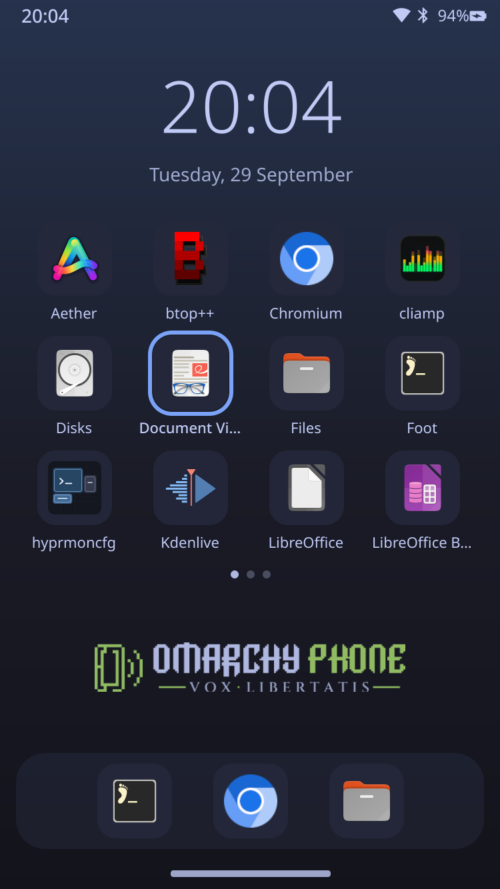 |
| kbdock: Down into the dock | 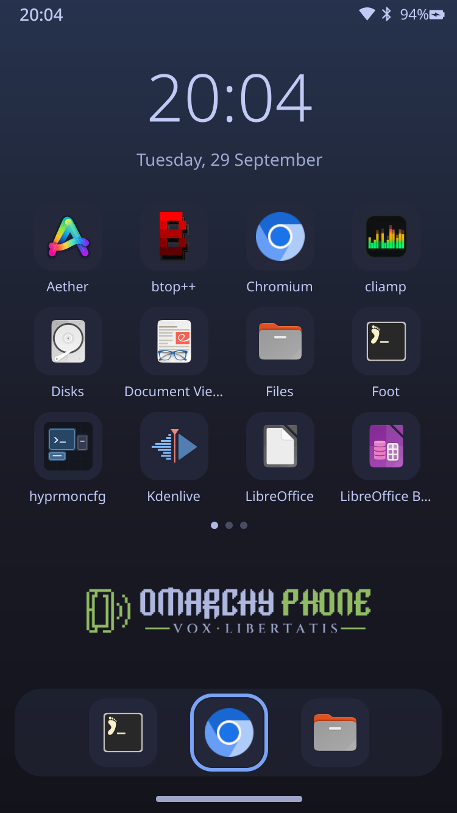 |
| kbsearch: typed "ma" | 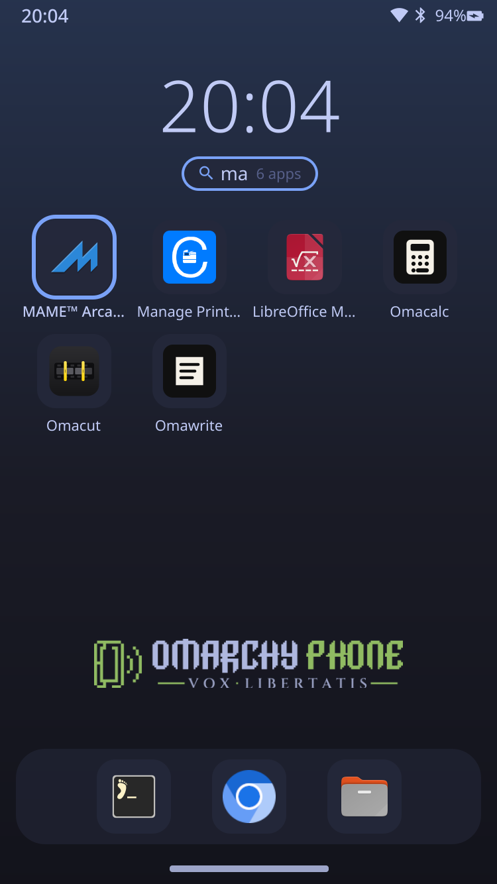 |
| kbshade: tiles | 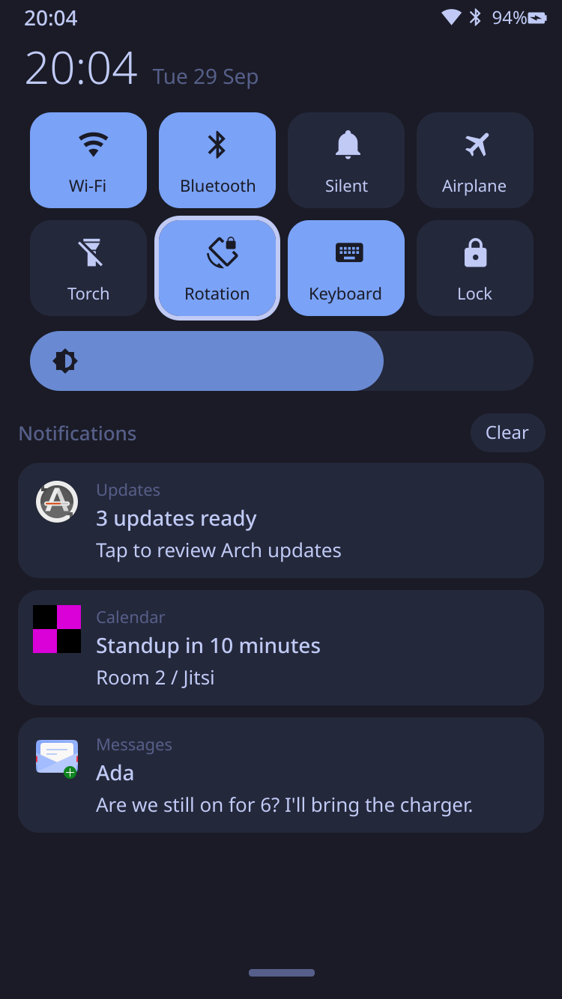 |
| kbnotif: down to a notification | 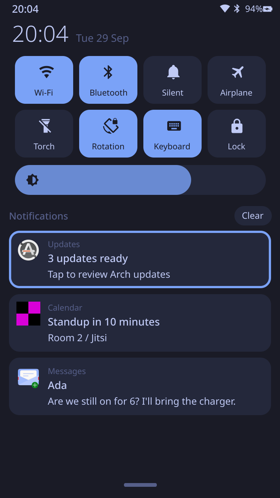 |
| kbswitcher | 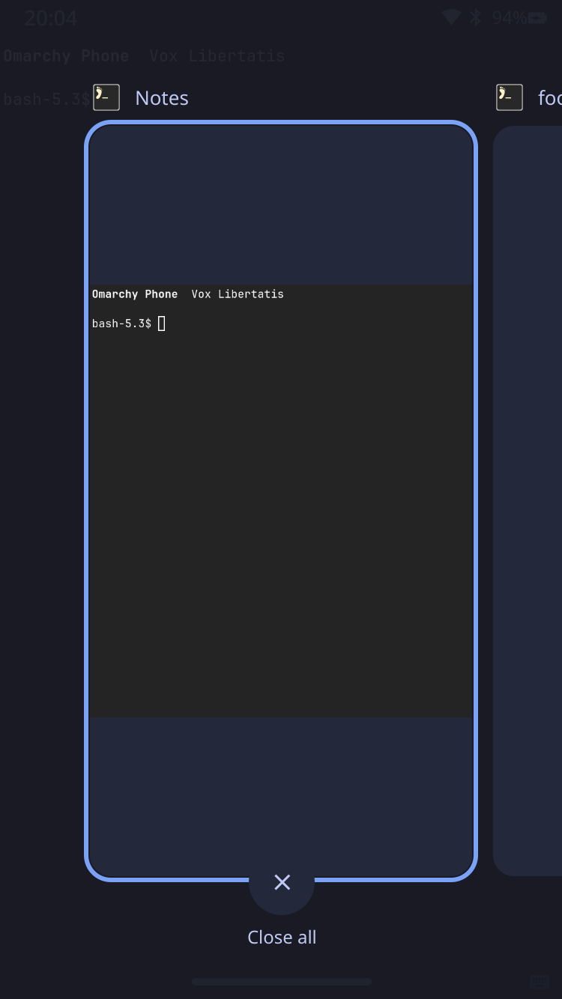 |
| kbpower |  |
| kbpin: digits typed on the keyboard | 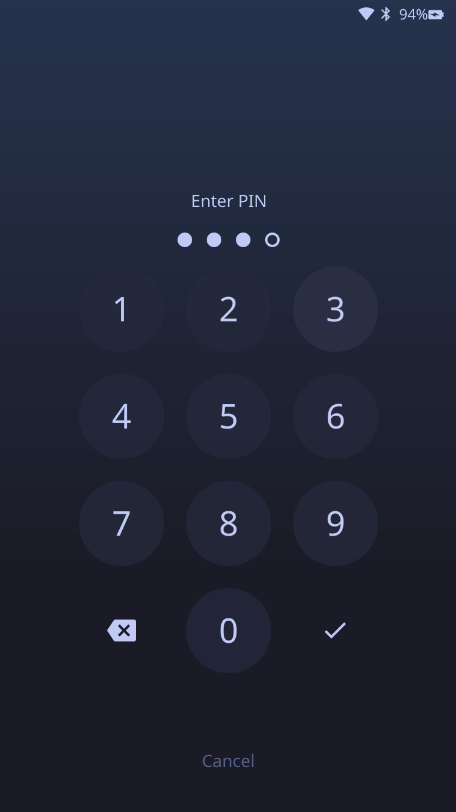 |
| kbcall: Right rings Accept | 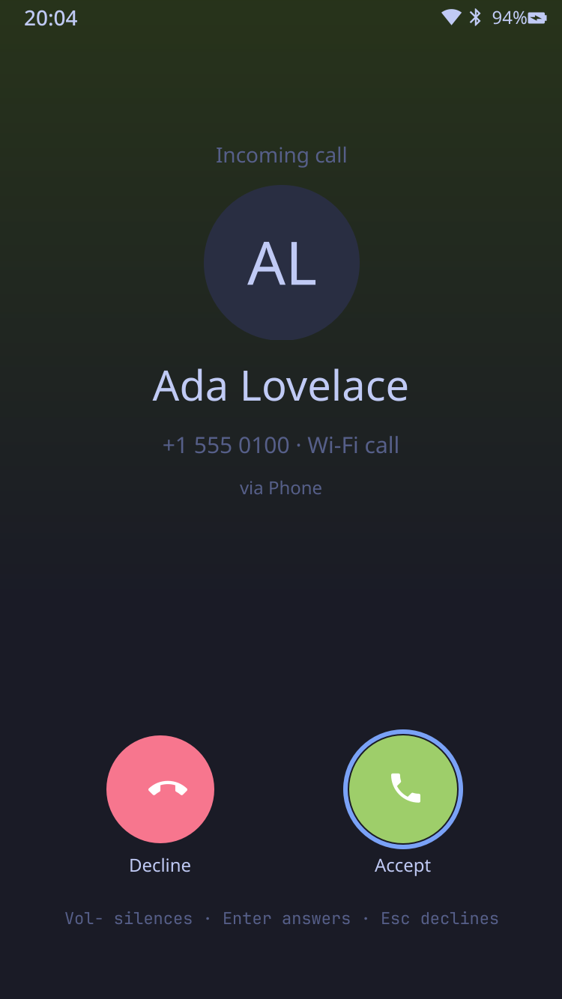 |

Focus-driven on-screen-keyboard scenarios:

| Scenario | Screenshot |
|---|---|
| oskgtk: a GTK4 field focused auto-shows it, typed text lands via the input method | 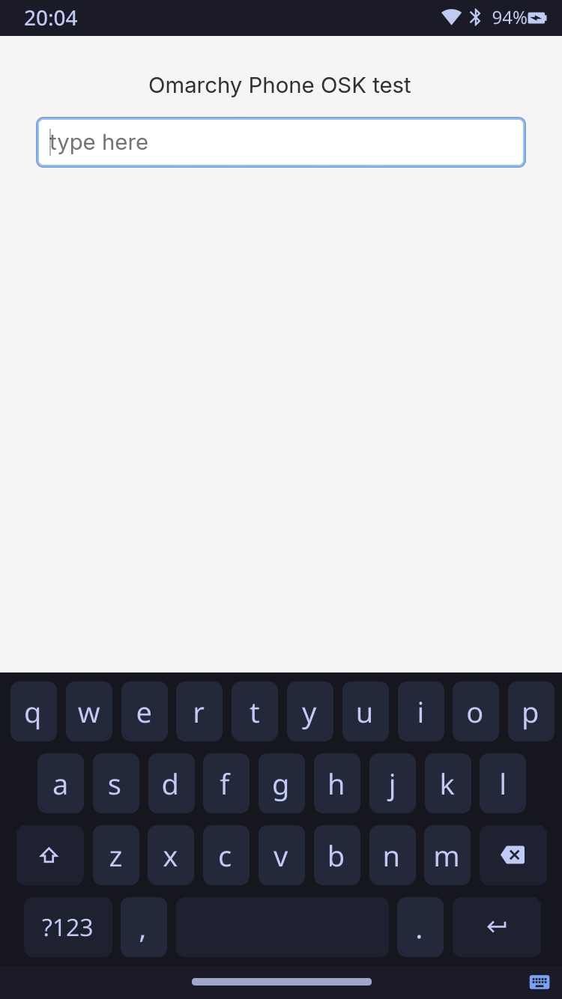 |
| oskgtk: manual toggle hides it while the field is still focused | 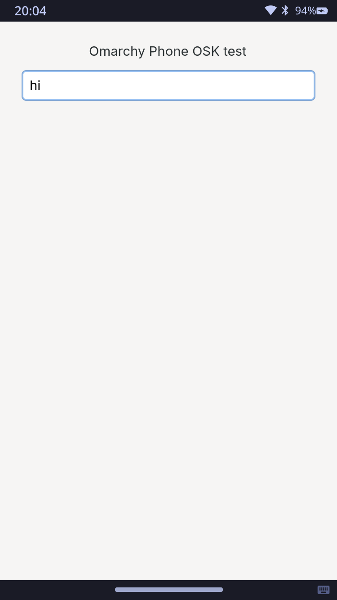 |
| oskfoot: foot auto-shows it too, typed text reaches the terminal | 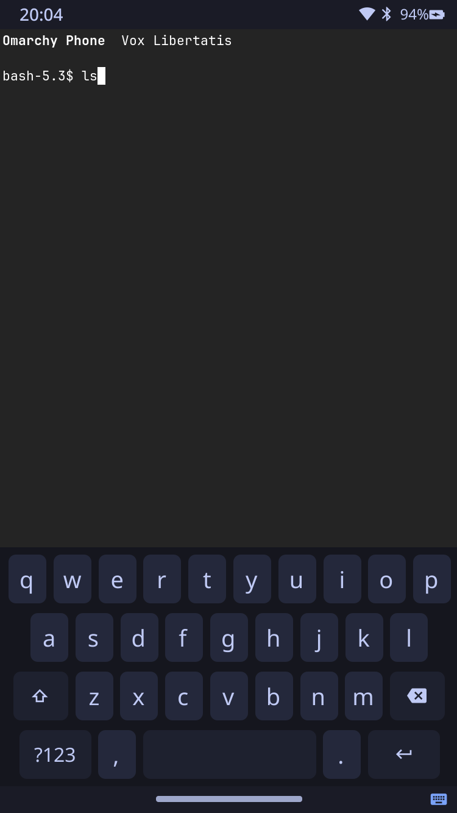 |

## Non-goals (v1) and next steps

* Purpose-aware keyboard layouts (a numeric pad for phone-number/digit
  fields, hiding typed characters for passwords): the `content_type` event
  already arrives at `ophone-im` with this information: it's just not used
  yet.
* Auto-rotation (iio-sensor-proxy to monitor `transform`, respecting the
  rotation-lock tile).
* Cellular modem (ModemManager), SMS, and a settings app.
* Inline replies in the shade (the daemon already advertises support).
* Fingerprint unlock (Touch ID isn't supported on this hardware under Linux).
* Measure memory and frame time on the real device, and trim anything costly.
* A Settings/menu UI entry for "Change PIN" (today: `sudo ophone-pin set` at
  a shell).
* A setuid-root PIN verifier (or `pam_pwdfile`, not packaged for Arch Linux
  ARM) instead of the group-readable `pin-hash` file, if this ever stops
  being a single-owner device with passwordless sudo already gating the
  session user.
* On-screen numeric entry for `RequestPasskey`/`RequestPinCode` (this phone
  being asked to *provide* a code to a peer) -- refused today, not
  implemented.
* A "pairing mode" toggle (bounded-time `Discoverable`/`Pairable`) in the
  shade/settings, now that `bluetooth/main.conf` turns both off by default.
